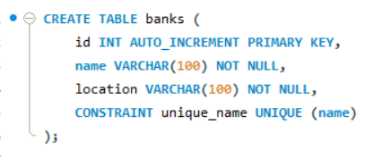
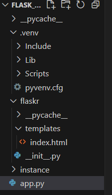
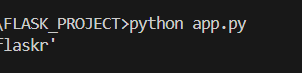

# My Flask Project
## CRUD application using Flask and MySQL
This is a bank management project created with Flask and MySQL. It is a CRUD application, which means that it is used for creating, reading, updating and deleting bank records.

The first step to the implementation of this project was the creation of the necessary bank database:

The MySQL database named ‘bankdb’ includes a table named ‘banks’ for bank records, with columns for bank id (primary key), unique bank name and bank location.

The Flask application was created by using the Visual Studio Code. The final project layout is shown below:

After setting the virtual environment ‘.venv’, I proceeded with the creation of the ‘flaskr’ directory. The ‘flaskr’ directory includes the ‘__init__.py’ file, the ‘app.py’ file and a subdirectory named ‘templates’ including the ‘index.html’ file. The first file contains the application factory and informs Python that the ‘flaskr’ directory should be treated as a package. The second one is the application file. The ‘index.html’ serves as the front-end interface for managing bank records. Its primary purpose is to provide a user-friendly web interface to perform CRUD (Create, Read, Update, Delete) operations on bank records.

In order for the application to run, the user must insert the ‘python app.py’ command into the terminal:

