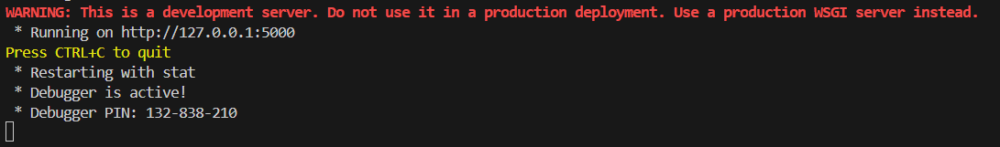
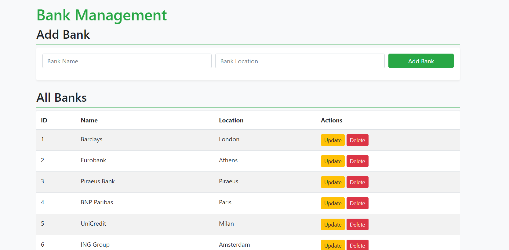
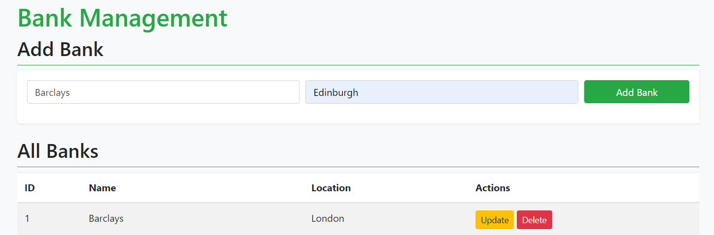
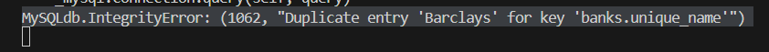
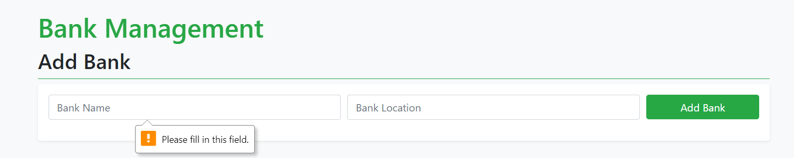

# My Flask Project
## CRUD application using Flask and MySQL
This is a bank management project created with Flask and MySQL. It is a CRUD application, which means that it is used for creating, reading, updating and deleting bank records.

The first step to the implementation of this project was the creation of the necessary bank database:

The MySQL database named ‘bankdb’ includes a table named ‘banks’ for bank records, with columns for bank id (primary key), unique bank name and bank location.

The Flask application was created by using the Visual Studio Code. The final project layout is shown below:

After setting the virtual environment ‘.venv’, I proceeded with the creation of the ‘flaskr’ directory. The ‘flaskr’ directory includes the ‘__init__.py’ file, the ‘app.py’ file and a subdirectory named ‘templates’ including the ‘index.html’ file. The first file contains the application factory and informs Python that the ‘flaskr’ directory should be treated as a package. The second one is the application file. The ‘index.html’ serves as the front-end interface for managing bank records. Its primary purpose is to provide a user-friendly web interface to perform CRUD (Create, Read, Update, Delete) operations on bank records.

In order for the application to run, the user must insert the ‘python app.py’ command into the terminal:

Note: This application was created for development purposes and not for production:

Once the application starts running, the user can hover over the URL address, which acts as a hyperlink to the web page (`http://127.0.0.1:5000`). By clicking on the ‘Follow link’ command, the full page of the CRUD application is displayed on the screen, as seen in the picture below:

This is the application interface. The first thing the user sees is the ‘Add Bank’ section. There are two fields to fill, the ‘Bank Name’ and ‘Bank Location’. Once the user fills both fields and presses the ‘Add Bank’ button, the bank record will be added into the ‘banks’ table of the ‘bankdb’ database and will be also displayed at the bottom of the web page, within the ‘All Banks’ section.

Note: Since the database table ‘banks’ accepts only unique names, the table cannot have duplicate bank names. If the user tries to enter a bank name, while a record with the same name already exists, a duplicate name error will be displayed on the terminal:

The field filling for both attributes is obligatory. If the user does not fill one of the fields or both of them, a warning message will be displayed, as seen below:

