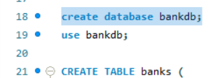

# My Flask Project
## CRUD application using Flask and MySQL
This is a bank management project created with Flask and MySQL. It is a CRUD application, which means that it is used for creating, reading, updating and deleting bank records.

The first step to the implementation of this project was the creation of the necessary bank database:

The MySQL database named ‘bankdb’ includes a table named ‘banks’ for bank records, with columns for bank id (primary key), unique bank name and bank location.

